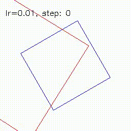

# GIoU for oriented bounding boxes

This code is a PyTorch-based, vectorized, and differentiable implementation of [Generalized union over intersection (GIoU)](https://giou.stanford.edu/) loss for rotated bounding boxes.

The base code for axis-aligned box manipulation and optimal matching was taken from [DETR](https://github.com/facebookresearch/detr) by Facebook Research.

For use cases, see `test.py`.

# Demo

Red boxes are optimized by gradient descent in respect to blue boxes.

1. Single box

2. Regular boxes on grid

3. Irregular boxes on grid

4. Random boxes

